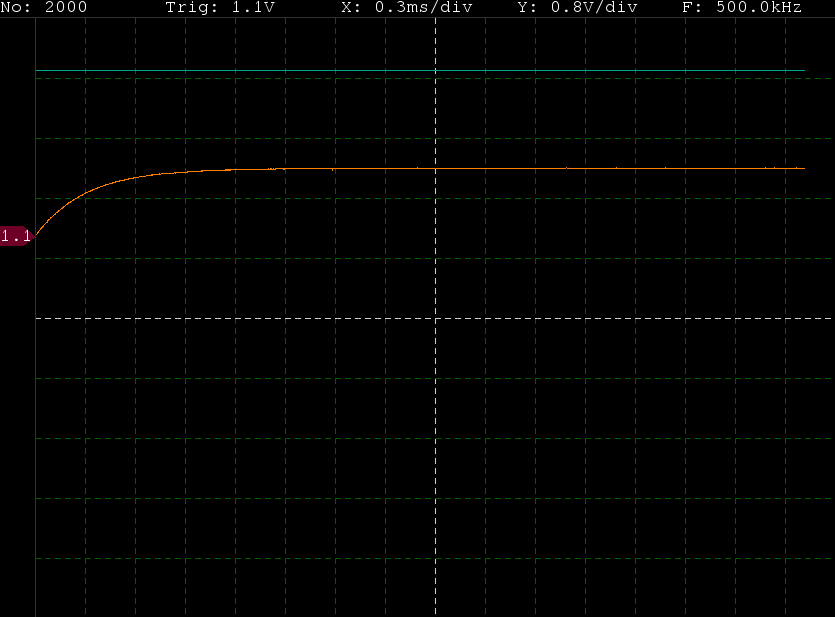
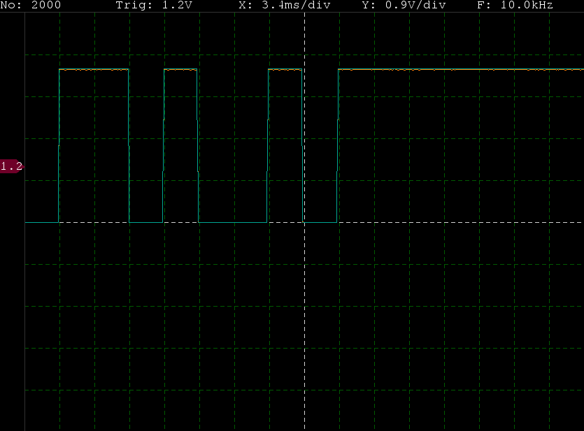
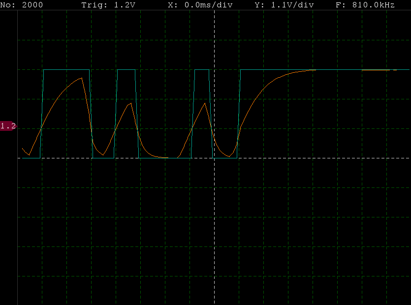

# Source code of GUI
User interface was written in Python 3.7 and uses Pygame and PySerial libraries.
### Run
`python3 ./OscilGUI.py <serial device>`

For example:
`python3 ./OscilGUI.py /dev/ttyACM0`
### Usage
Samples recorded by MCU are represented as orange line. Blue line is their approximation to digital signal.

Changing X scale can be done with mouse wheel, other settings are modified via keyboard shortcuts.

Key | Function
--- | ---
A | move graph left
D | move graph right
Arrow UP | increase Y scale
Arrow DOWN | decrease Y scale
Arrow LEFT | decrease X scale
Arrow RIGHT | increase X scale
I | increase trigger level
J | decrease trigger level
Z | increase frequency of samples gathering
X | decrease frequency of samples gathering
M | increase number of samples
N | decrease number of samples
SPACE | trigger now
O | stop oscilloscope
P | wait for trigger

### Screenshots
Waveform of released tact switch:
 

Waveform of serial signal at 300 baudrate:
 

Waveform of serial signal at 115200 baudrate:
 