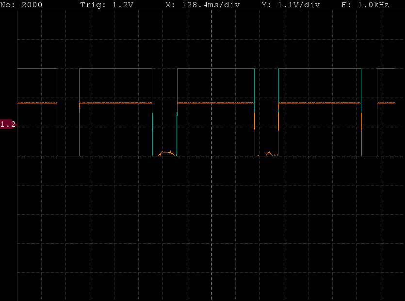
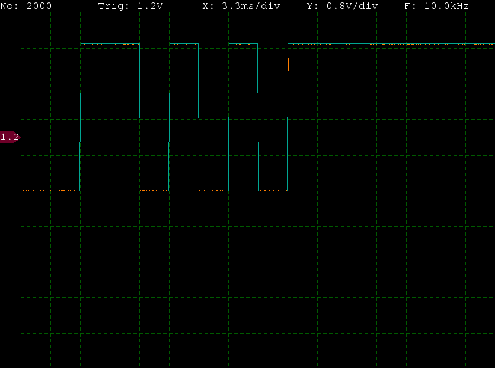
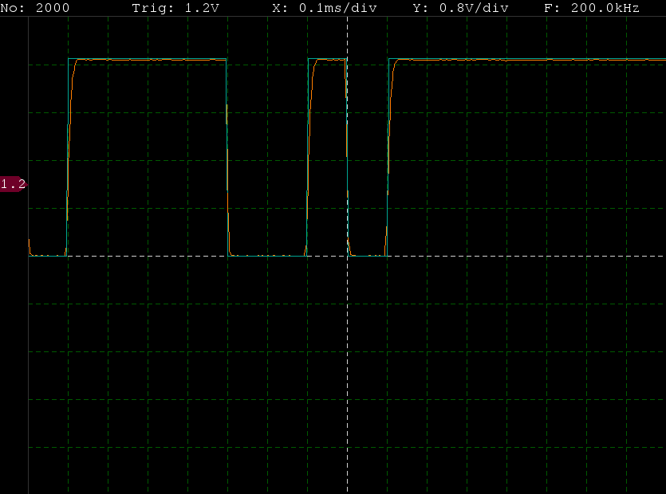

# STM32Oscil
Oscilloscope built on STM32 microcontroller
### Project structure
Directory|Content
---|---
GUI/| User interface written in Python using Pygame and PySerial libraries
MCU/| Source code of application running on STM32 microcontroller

### Example waveforms captured

 

### TODO:
- fix displaying X scale in GUI app
- add reliable error checking in communication with MCU
